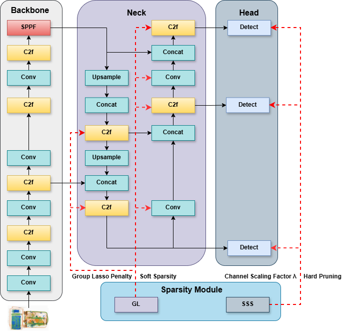
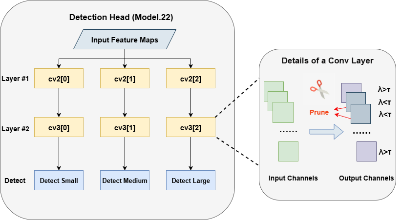
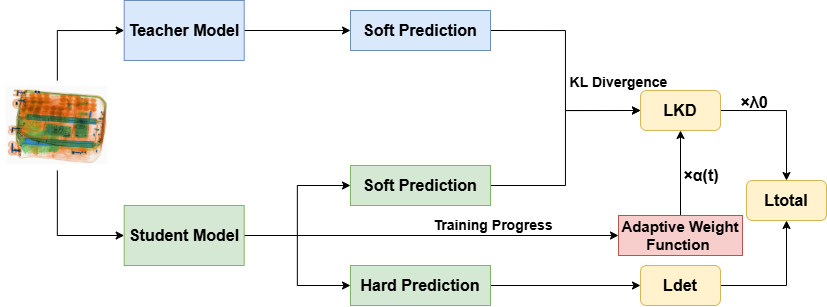
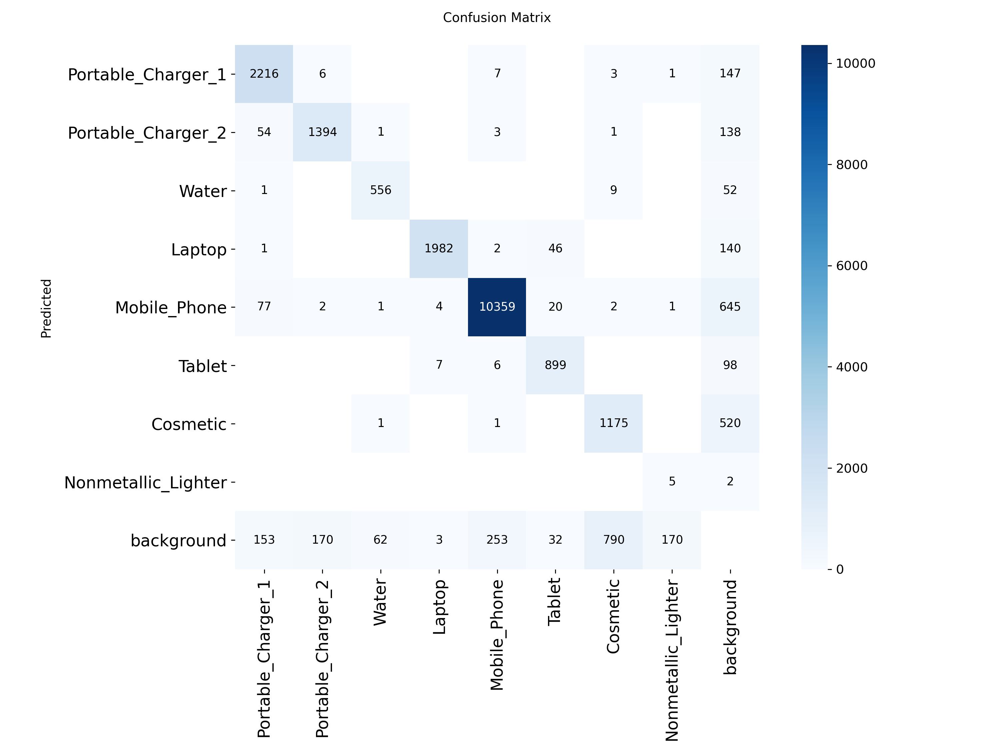
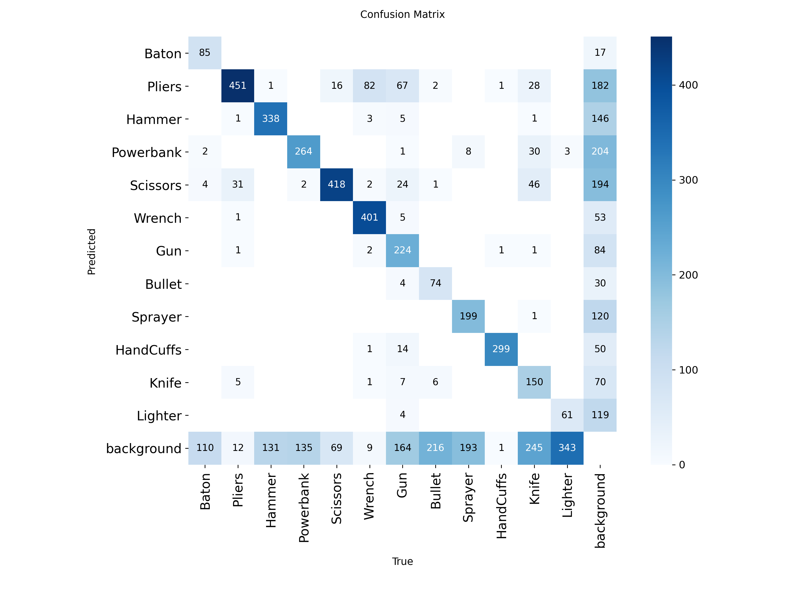
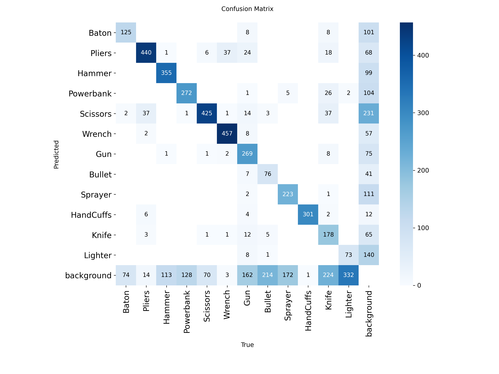
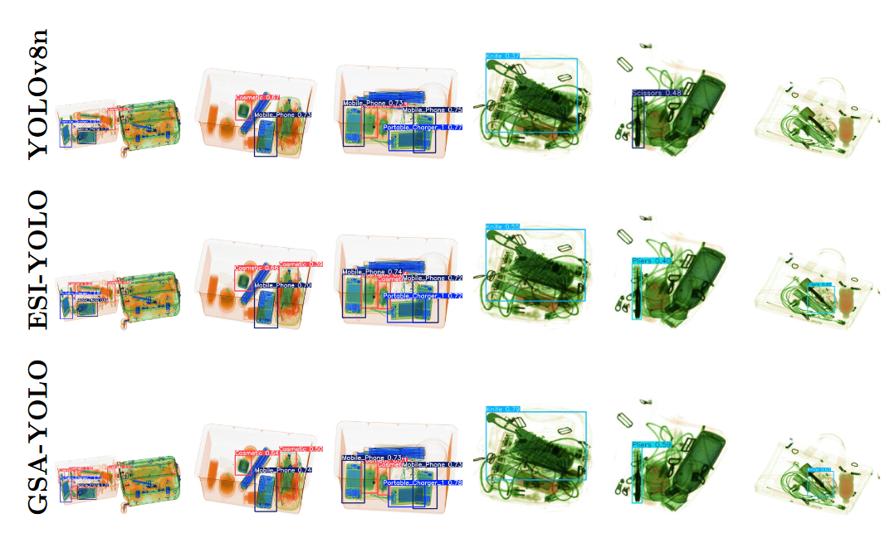

# GSA-YOLO: A High-Efficiency Framework via Structured Sparsity and Adaptive Knowledge Distillation for Real-Time X-ray Security Inspection

[](https://pytorch.org/)
[](https://github.com/ultralytics/ultralytics)
[](LICENSE)

Official implementation of the paper **"GSA-YOLO: A High-Efficiency Framework via Structured Sparsity and Adaptive Knowledge Distillation for Real-Time X-ray Security Inspection"**.

---

## ✨ Highlights
- 🚀 **High Efficiency**: Achieves **189.62 FPS** on NVIDIA RTX 3090.
- 📉 **Model Slimming**: Reduces GFLOPs from **8.7G to 8.0G** while improving accuracy.
- 🎯 **Robust Performance**: Improves mAP50:95 by **2.4%** (HiXray) and **1.8%** (PIDray) over the YOLOv8n baseline.
- 🛠️ **Three Core Modules**: 
  - **Group Lasso (GL)** for feature refinement in the Neck.
  - **Sparse Structure Selection (SSS)** for hard pruning in the Head.
  - **Adaptive Knowledge Distillation (Ada-KD)** for comprehensive accuracy recovery.

---

## 🏗️ Framework Overview

GSA-YOLO is built upon the YOLOv8n architecture and strategically integrates structured sparsity and knowledge transfer.

 

*Figure 1: The detailed GSA-YOLO framework integrating GL, SSS, and Ada-KD modules.*

---

 

*Figure 2: The framework of Sparse Structure Selection(SSS).*

---
 

*Figure 3: The framework of Adaptive Knowledge Distillation(Ada-KD).*

---

## 📊 Main Results

### 1. Comparison on HiXray Dataset
Our model outperforms various state-of-the-art methods in both speed and accuracy.

| Model | GFLOPs | FPS (Inf) | Precision | Recall | mAP50 | mAP50:95 |
| :--- | :---: | :---: | :---: | :---: | :---: | :---: |
| Faster R-CNN | 168.7G | 15.02 | 0.841 | 0.763 | 0.788 | 0.467 |
| YOLOv5n | 4.5G | 161.31 | 0.859 | 0.773 | 0.799 | 0.486 |
| YOLOv8n (Baseline) | 8.7G | 170.58 | 0.882 | 0.769 | 0.806 | 0.507 |
| ESI-YOLO | 8.9G | 164.48 | 0.886 | 0.779 | 0.815 | 0.517 |
| GEMA-YOLO | 16.1G | 82.57 | 0.895 | 0.788 | 0.822 | 0.523 |
| **GSA-YOLO (Ours)** | **8.0G** | **189.62** | **0.902** | **0.795** | **0.827** | **0.531** |

---

### 2. Comparison on PIDray Dataset (Detailed Subsets)
GSA-YOLO demonstrates superior robustness in "Hard" and "Hidden" occlusion scenarios.

| Model | Easy (mAP50:95) | Hard (mAP50:95) | Hidden (mAP50:95) | **Average (mAP50:95)** |
| :--- | :---: | :---: | :---: | :---: |
| Faster R-CNN | 0.679 | 0.632 | 0.403 | 0.571 |
| YOLOv5n | 0.691 | 0.651 | 0.406 | 0.583 |
| YOLOv8n (Baseline) | 0.750 | 0.718 | 0.514 | 0.661 |
| ESI-YOLO | 0.759 | 0.724 | 0.518 | 0.667 |
| GEMA-YOLO | 0.763 | 0.729 | 0.517 | 0.670 |
| **GSA-YOLO (Ours)** | **0.771** | **0.734** | **0.524** | **0.679** |

---

### 3. Ablation Study
The synergistic effect of GL, SSS, and Ada-KD on the YOLOv8n baseline (tested on HiXray).

| GL | SSS | Ada-KD | GFLOPs | FPS (Full) | mAP50 | mAP50:95 |
| :---: | :---: | :---: | :---: | :---: | :---: | :---: |
| $\times$ | $\times$ | $\times$ | 8.7 | 152.16 | 0.806 | 0.507 |
| $\checkmark$ | $\times$ | $\times$ | 8.7 | 152.16 | 0.809 | 0.501 |
| $\times$ | $\checkmark$ | $\times$ | 8.0 | 174.26 | 0.808 | 0.504 |
| $\checkmark$ | $\checkmark$ | $\times$ | 8.0 | 174.26 | 0.811 | 0.509 |
| **$\checkmark$** | **$\checkmark$** | **$\checkmark$** | **8.0** | **174.26** | **0.827** | **0.531** |

---

## 🖼️ Visualizations

### Confusion Matrix
Evaluation of classification robustness and detection completeness.


<div align="center">

| Baseline | GSA-YOLO |
|----------|----------|
|  |  |
|  |  |

</div>


### Case Study
Inference results in scenarios with high object density and severe occlusion.


*Figure 2: Comparative results: (Top) Baseline, (Middle) ESI-YOLO, (Bottom) GSA-YOLO.*

---

## ⚙️ Hyperparameter Settings
Based on our sensitivity analysis, the following "Sweet Spot" parameters are recommended:

| Module | Hyperparameter | Optimal Value | Range |
| :--- | :--- | :---: | :---: |
| **GL** | $\beta$ (Regularization) | 1e-4 | [3e-5, 5e-4] |
| **SSS** | $\gamma$ (Pruning Intensity) | 1e-3 | [1e-5, 3e-3] |
| **Ada-KD** | $\lambda_0$ (Intensity) | 4 | [2, 6] |
| **Ada-KD** | $\theta$ (Decay) | 15 | [15, 25] |

---


## ⚙️ Installation

### Stage 0: requirements

Python: 3.10.18

PyTorch: 2.7.1

CUDA: 12.6

Hardware: NVIDIA RTX 3090 (or similar with 24GB VRAM)

pip install ultralytics==8.3.199 torch==2.7.1+cu126 --extra-index-url https://download.pytorch.org/whl/cu126

### Stage 1: Sparsity-Induced Pre-training
Apply Group Lasso (GL) and Sparse Structure Selection (SSS) to identify redundant channels.

python train.py --model yolov8n.yaml --data hixray.yaml --epochs 100 --batch 64 --sparsity --beta 1e-4 --gamma 1e-3


### Stage 2: Structural Pruning
Generate the compact model by removing channels with scaling factors $\lambda < \tau$.

python prune.py --weights runs/train/weights/last.pt --threshold 0.001

### Stage 3: Accuracy Recovery via Ada-KD
Fine-tune the pruned student model using the YOLOv8m teacher.

python train_distill.py --teacher yolov8m.pt --student pruned_model.pt --data hixray.yaml --lambda0 4 --theta 15

## 📚 Citation

If you use GSA-YOLO in your research, please cite the following paper:

```bibtex
@article{kong2026gsayolo,
  title={GSA-YOLO: A High-Efficiency Framework via Structured Sparsity and Adaptive Knowledge Distillation for Real-Time X-ray Security Inspection},
  author={Jiahao Kong},
  journal={Nuclear Physics B},
  year={2026}
}


